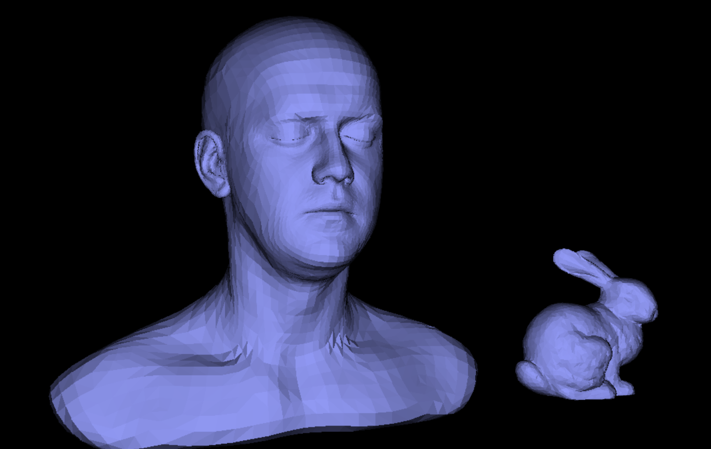

# 3D Renderer
This project is a simple 3D renderer implemented in C using the SDL2 library. It demonstrates fundamental concepts of 3D graphics including projection, face culling, rotation, lighting, and a z-buffer all powered by complex linear algebra and calculus

## Features
- Perspective projection  
- Mouse-controlled 3D rotation  
- Back-face culling toggle (`c` key)  
- Solid face rendering toggle (`f` key)  
- Dynamic lighting via dot product  
- Resizable SDL window  

## Preview

*Fully rendered head and bunny models*

## Build Instructions
### Requirements
 - SDL2
 - GCC or any C compiler

### Compilation
```bash
make
```

### Run
```bash
./Graphics
```

## Controls
| Key/Input   | Action                   |
|-------------|--------------------------|
| `esc`       | toggle fullscreen        |
| `f`         | toggle filled face mode  |
| `c`         | toggle back-face culling |
| Mouse       | Rotate camera            |
| `wasd`      | Movement keys            |
| Right Click | Retrieve mouse         |
